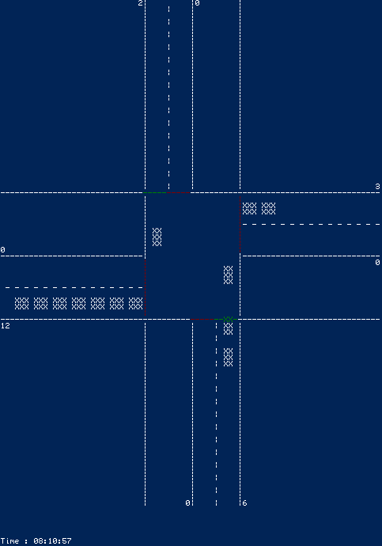
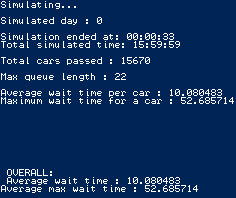

# Optimization of Traffic Lights using Reinforcement Learning
Project on 1st semester looking at the optimization problem of traffic flow in traffic lights.
A simulation is created in combination with three different approaches to managing traffic: Traffic Based, Time Based, and Q-Learning based. The specific data used by the simulation was collected by Vejdirektoratet and found on their website. To introduce some randomness to the appearence of the cars a Poisson distribution was used. The programming language used is C due to the imperative programming course we attended simultaneously.

## Running the models
Find the preferred controller and compile and run it. 
If you select the option of simulating with graphics on, you will achieve the optimal formatting in your terminal by going to settings and changing font type to Raster Fonts and font size to 6x8.

### Options
- Simulate with graphics OFF(0) or ON(1)
  - If ON: Simulation timescale (1.0 = realtime and 2.5 = 1 sec in real life is 2.5 sec in the simulation)
- Start time in seconds (0 = 00:00 and 28800 = 08:00)

### Images of simulation
#### Running simulation with graphics

#### Results from running simulation without graphics

# Group Members and Report:
Asger Bertel, Daniel Thomsen, Hannah Lockey, Mads Faber, Magnus Kirkegaard, Niki Ewald Zakariassen, Simon Steiner

[Report](Report.pdf)
